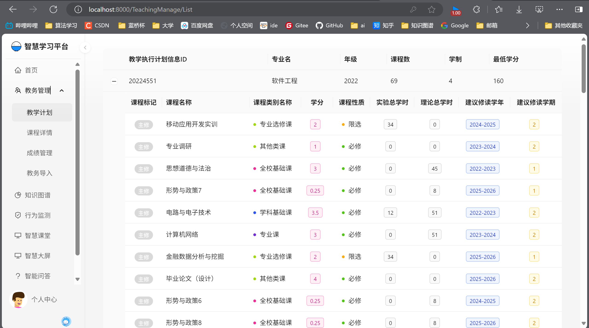
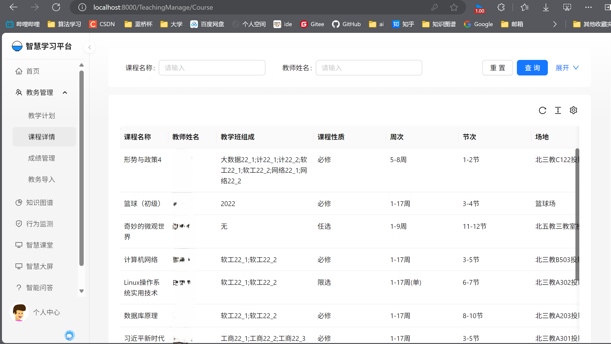
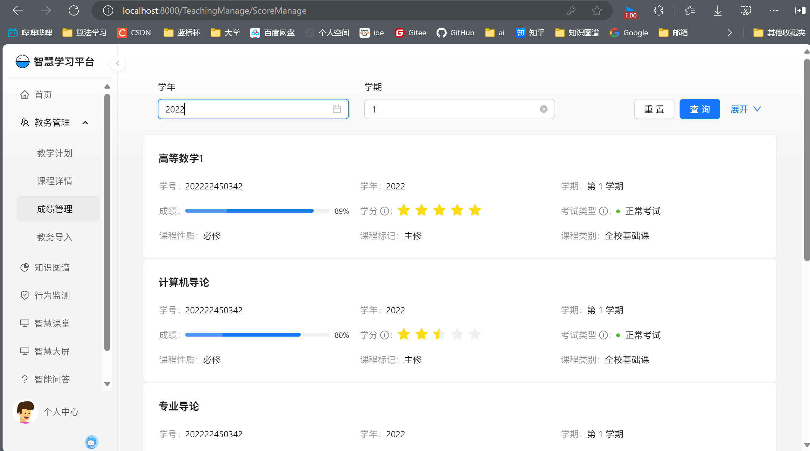
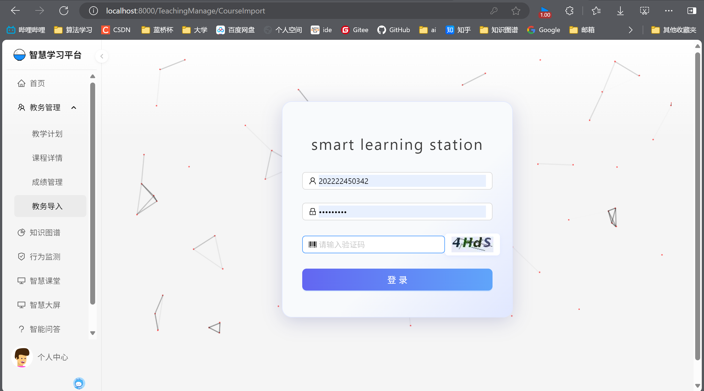
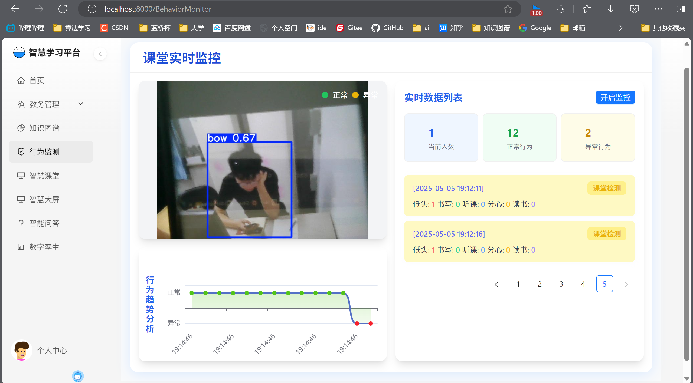
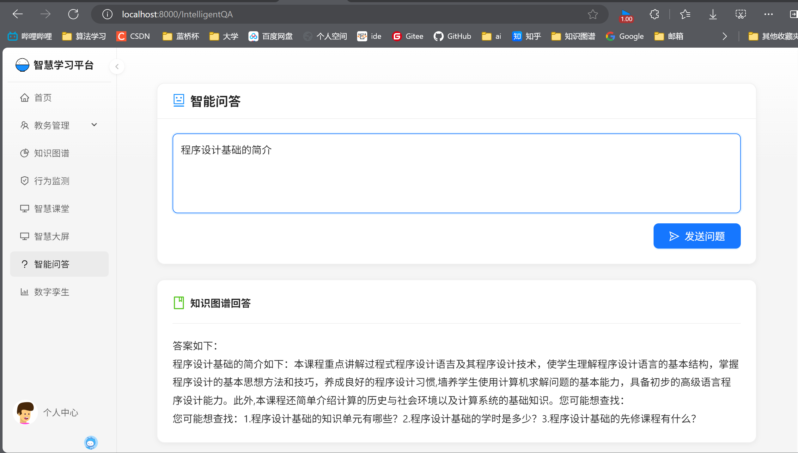
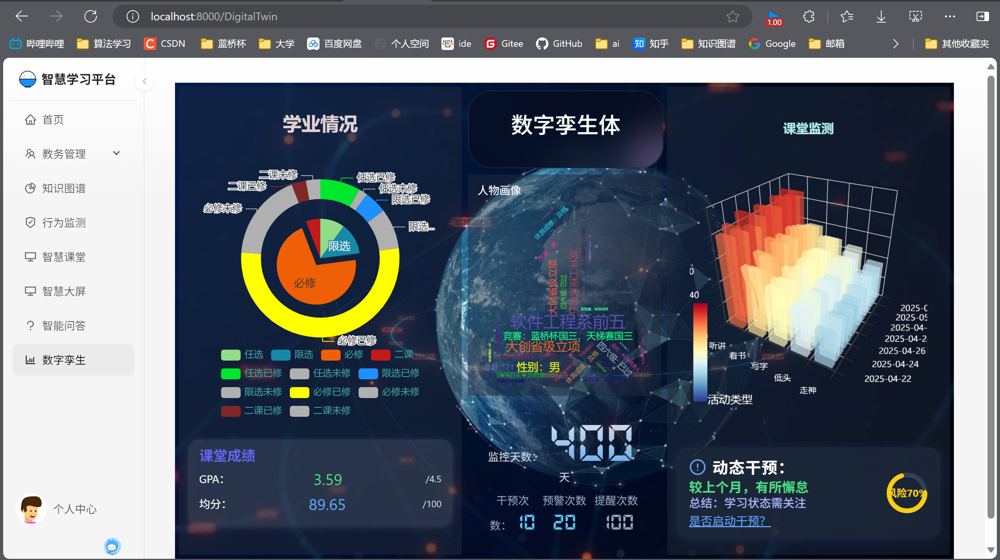

# LearningSystem 智能教育管理系统

> 完整项目地址：https://github.com/enhead/learning-system
>
> - 后端：https://github.com/enhead/LearningSystem-bakend.git
> - 前端：https://github.com/enhead/LearningSystem-frontend.git

## 项目简介

本项目旨在解决高校教学中缺乏实时反馈和动态调整机制的问题，通 过构建学生的数字孪生体，结合自动化收集的基础数据源，并动态监控分 析学生的学习行为、学习成效和课堂参与度等信息，以实现数据驱动的动 态干预能力。该平台将为教师提供基于数据的决策支持，推动高校课程教 学模式的创新发展。

## 研究成果

**1.** **自动化采集学生个人的教务数据作为基础数据源来构建数字孪生体**

本项目为了构建一个更为贴近真实的学生数字孪生体，选取了教务官网的数据作为基础数据源，基于selenium自动测试工具、browsermob-proxy抓包工具以及httpclient网络请求工具，结合多种爬虫形式以模拟登录的方式获取到真实数据。获取到真实数据后，对数据进行清洗，分析，提取需要的数据，将结构化的数据存储在关系型数据库中。

**2.** **目标检测算法及其训练**

为了实现课堂的行为分析，本项目引入了YOLO算法，来跟踪课堂以及学生的整体情况，可以用来构建学生个人的数字孪生体和分析出课堂的整体情况，为学生的动态干预以及教学评估提供重要参考。

具体的工作包括：

（1）构建包含多种课堂场景和学生行为的图像数据集，来源包括自主采集以及部分公开数据集包括但不限于SCB(学生课堂行为公开数据集)、飞浆AI Studio中公开的学生数据集。

（2）基于该数据集训练YOLO模型，实现对学生和课堂环境的精准检测。

**3.** **课堂实时监测实施方案**

通过WebSocket网络协议，基于YOLO算法和百度智能云的人脸库和人脸搜索技术，我们的系统实现了对课堂的实时监控和数据驱动的教学质量评估。系统不仅评估整体教学效果，还能精确到个体学生，通过人脸识别将行为数据与学生个人关联，使教师能够针对学生的具体情况进行教学调整或提供辅导。这种细致的个性化干预有助于提升学生的学习成效和课堂参与度。综合来看，该系统为教育工作者提供了深入的数据支持，使他们能够更有效地优化教学方法，加强课堂管理，并实施针对性的学生指导，从而显著提高教育质量。

**4.** **课程知识图谱构建**

本项目还将构建课程知识图谱，以此来提供更加个性化的内容推荐以及完成智能问答功能。这里详细设计了课程知识图谱的逻辑架构，采用自底向上的方式来构建知识图谱，具体步骤如下：

  （1）数据源的采集和预处理：选取河北经贸大学计算机大类的培养方案作为主数据源，同时引入了部分课程教材、教辅材料作为辅助数据源。

（2）知识抽取：知识抽取主要针对非结构化数据展开。首先，利用 BERT-BiLSTM-CRF 模型完成基础的命名**实体识别**；接着，在识别出的实体基础上进行**属性抽取**，以获得更丰富的实体特征；最后，使用 BERT 等模型进行**关系抽取**，识别实体之间的关联。

  （3）知识融合：知识抽取的结果可能包含错误和冗余信息，因此需要进行清理和整合，以保证知识图谱的质量。为此，本系统从实体对齐、实体消歧、属性对齐三方面采取措施，从而有效地清理和整合数据，以提升知识图谱的质量。

  （4）知识存储：我们选择了Neo4j作为知识图谱的存储解决方案。

**5.** **基于知识图谱以及外部知识库的智能问答**

智能问答的实现流程如下：首先使用HanLP分词器对用户输入进行**分词和词性标注**，提取关键实体和关系。然后利用朴素贝叶斯分类器对**问题分类**，识别问题意图。接下来，通过BERT-BILSTM-CRF模型实现**命名实体识别**，精确提取课程知识点等实体，最后生成**Neo4j查询语句**，在知识图谱中检索并返回相应答案。当问题不存在时，使用外部知识库查询，以此来增强系统功能。

**6.** **学生数据的可视化及其分析，用户画像可视化**

本项目通过构建数据分析与可视化模块，深入挖掘学生的多维数据，以直观展示学生的课堂表现、学分预警、学业情况和用户画像。结构化数据被存储于关系型数据库，知识图谱和用户画像等半结构化数据存放在图数据库中，结合ECharts和D3.js等工具实现可视化展示。该模块为教师和学生提供学生学业状态的实时洞察，支持针对性的动态干预措施，助力个性化学习指导与教育管理决策。

**7.** **整合web项目的形式**

本项目最终呈现的效果是一个web平台，采用前后端分离的形式进行开发。通过REST架构（使用URL来访问资源）来将各个有机部分结合起来。本项目通过apifox进行接口管理，通过git进行版本管理，使得前后端人员能够并行开发。

前端部分：前端部分主要基于React和Umi Max框架构建，并结合Ant Design组件库和ECharts数据可视化工具，通过API和WebSocket与后端进行交互。

后端部分：

  （1）基础业务端： 基于Spring Boot整合SSM（Spring MVC、Spring Framework、MyBatis）进行开发，简化配置，提高开发效率。采用Maven统一管理依赖版本，保证项目稳定性。

  （2）智能问答端：智能问答端基于Flask框架开发，轻便的处理请求响应。通过py2neo 包来实现对 Neo4j 图数据库的操作。

  （3）行为检测端：基于YOLO模型实现。


## 界面展示
















## 项目结构

```
learning-system/
├── LearningSystem-bakend/                          # 后端项目
│   ├── intelligent-learning-situation-analysis/    # 智能学习情境分析及其基础业务系统
│   ├── course-qa-system/                           # 课程知识图谱系统
│   └── yolov5/                                     # YOLOv5 行为检测
└── LearningSystem-frontend/                        # 前端项目
    ├── src/                                        # 源代码
    ├── mock/                                       # 模拟数据
    └── public/                                     # 静态资源
```

## 联系方式

- 项目负责人：enhead
- 邮箱：2790440179@qq.com
- 项目地址：https://gitee.com/enhead/learning-system.git

## 许可证

待定
